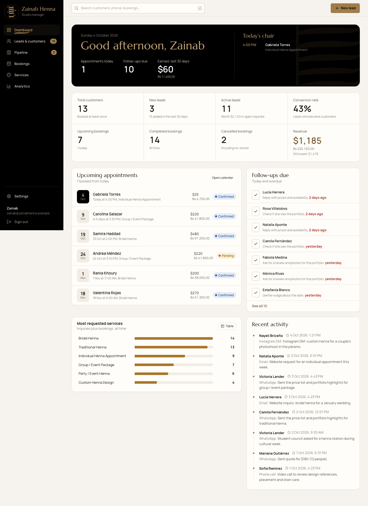
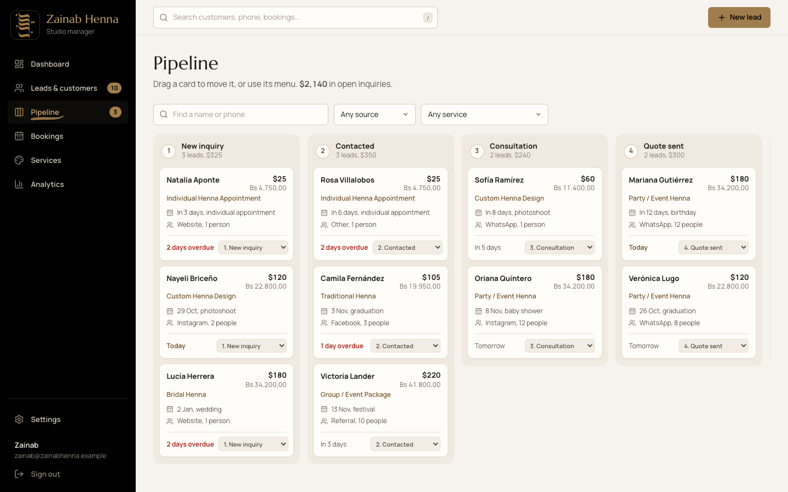
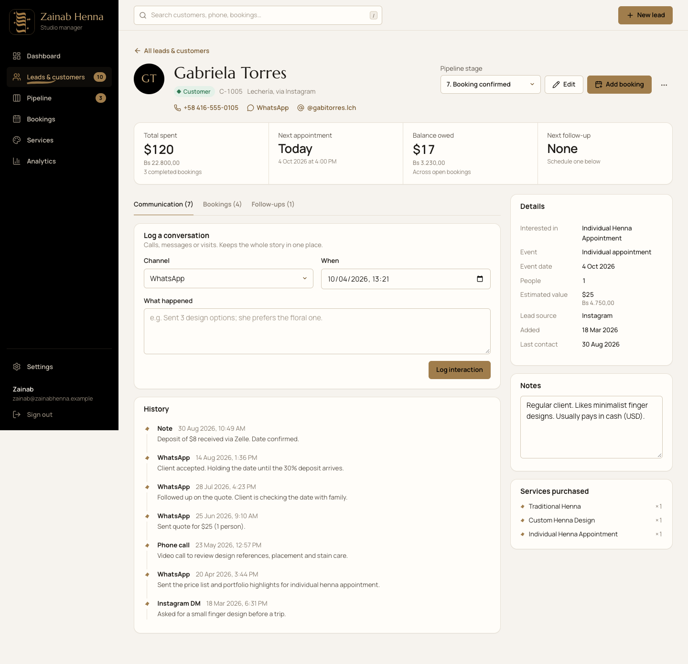
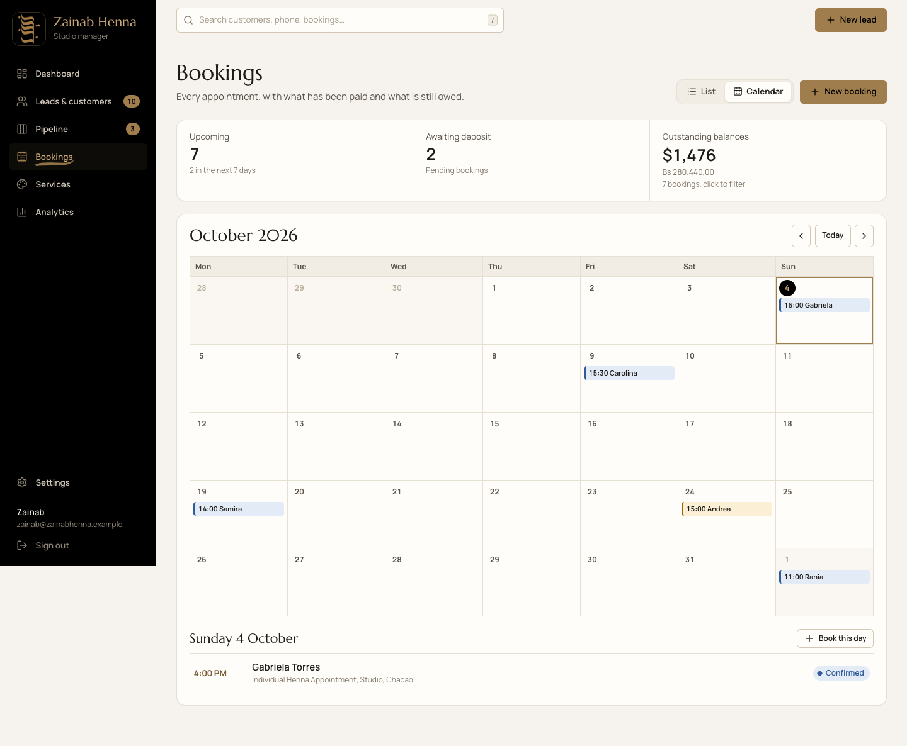
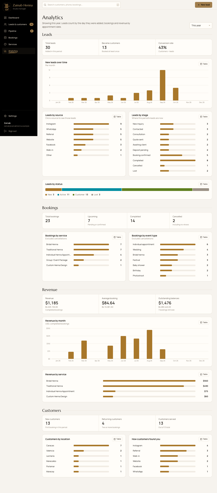

# Zainab Henna CRM

A customer-relationship manager for **Zainab Henna**, a henna artistry business in Venezuela. It brings leads, the booking pipeline, appointments, services, customer history and business analytics into one place.

This is a working MVP. Every screen runs on real application logic: validation, state changes, pipeline and booking sync, and analytics. For now it uses demo data stored in the browser. The data layer sits behind one interface, so a database or REST backend can be connected later without rebuilding the frontend.



| Pipeline | Customer profile |
| --- | --- |
|  |  |

| Bookings calendar | Analytics |
| --- | --- |
|  |  |

---

## Contents

1. [Features](#features)
2. [Quick start](#quick-start)
3. [Scripts](#scripts)
4. [Configuration](#configuration)
5. [Project structure](#project-structure)
6. [Architecture](#architecture)
7. [Data model](#data-model)
8. [Business rules](#business-rules)
9. [Brand & design system](#brand--design-system)
10. [Testing](#testing)
11. [Backend integration](#backend-integration)
12. [Website integration](#website-integration)
13. [Roadmap](#roadmap)

---

## Features

**Dashboard.** A "Today" summary (today's appointments, follow-ups due, revenue over the last 30 days), then eight key numbers: total customers, new leads, active leads, conversion rate, upcoming, completed and cancelled bookings, and revenue. Below those: upcoming appointments, follow-ups due (tick them off in place), the most requested services, and recent activity. Every key number links to the matching list.

**Leads & customers.** Add, edit, archive/restore and delete leads, with a confirmation step before deleting. Search is accent-insensitive and covers name, phone digits, email, @handle and notes. You can filter by stage, source, service, event type, follow-up status and date added, sort any column, page through results, and export the current view to CSV. Tabs split the list into All, Open leads, Customers, Lost and Archived.

**Pipeline.** A Kanban board with the ten henna-specific stages. Move a card by dragging it, or with the "Move to" menu on each card, which works with a keyboard and on phones. Moving a lead to **Booking confirmed** opens a prefilled booking form, so every confirmed lead appears in Bookings.

**Bookings.** A list view and a month calendar view (with a day agenda). The list tracks price, deposit and remaining balance for each booking, shows the outstanding total as a filter you can click, and has quick actions: mark completed, mark paid, no-show, cancel. Statuses are Pending, Confirmed, Completed, Cancelled and No-show. Bookings also export to CSV.

**Services.** An editable price list. Each service has a flat or per-person price, an estimated duration and an active/inactive switch, plus a running count of bookings and revenue.

**Customer profiles.** Contact links (call, WhatsApp, email, Instagram), stage control, total spent, the next appointment, balance owed and the next follow-up. There's a log of every conversation, upcoming and previous bookings, the services purchased, editable notes, and scheduled and completed follow-ups.

**Analytics.** Lead, booking, revenue and customer metrics, filterable by Today, This week, This month, Last 30 days, Last 90 days, This year, All time or a custom range. Charts show hover values, can switch to a table view, and clicking a bar opens the matching filtered list.

**Currency.** Amounts are stored in USD. Bolívar (VES) amounts are calculated from an exchange rate you set in Settings. Prices can be shown in USD, VES, or both.

**Global search.** Press `/` or `Ctrl/⌘ K` to search customers (including by phone number), bookings and services from anywhere in the app.

**Quality basics.** Responsive layout (desktop to phone), keyboard focus states, accessible dialogs, loading skeletons, empty states, error states with a retry button, and toast confirmations.

## Quick start

Requirements: **Node.js 20 or newer** (22 LTS recommended) and npm.

```bash
git clone <your-repo-url> zainab-henna-crm
cd zainab-henna-crm
npm install
cp .env.example .env.local   # optional: defaults work without it
npm run dev
```

Open http://localhost:5173 and sign in with the demo account. You can also click **Fill in demo details** on the sign-in page.

- Email: `zainab@zainabhenna.example`
- Password: `henna2026`

The demo data is generated relative to today's date, so the dashboard always has upcoming appointments and follow-ups due. To start over, go to **Settings → Reset demo data**.

To build for production:

```bash
npm run build      # type-checks, then outputs static files to dist/
npm run preview    # serves dist/ locally
```

**Live demo:** https://mistyrose-wildcat-480165.hostingersite.com (Hostinger, static build; the sign-in hint is hidden there; ask the owner for the demo password).

`dist/` is a static single-page app. `public/.htaccess` handles routing on Apache/LiteSpeed hosts such as Hostinger. When hosting it, rewrite unknown paths to `index.html` so links like `/leads/C-1005` work. (Netlify: `_redirects`; Vercel and Hostinger: an SPA rewrite rule.)

## Scripts

| Command | What it does |
| --- | --- |
| `npm run dev` | Start the dev server with hot reload |
| `npm run build` | Type-check and build to `dist/` |
| `npm run preview` | Serve the production build |
| `npm run typecheck` | TypeScript only |
| `npm run lint` | Oxlint |
| `npm test` | Unit tests (Vitest): business rules, analytics, seed integrity |
| `npm run test:e2e` | End-to-end tests (Playwright) of the main workflows in Google Chrome |
| `npm run test:all` | All of the above |

## Configuration

All settings are read in [`src/config/env.ts`](src/config/env.ts), and defaults are in [`.env.example`](.env.example).

| Variable | Default | Purpose |
| --- | --- | --- |
| `VITE_DATA_SOURCE` | `local` | `local` = browser demo data; `api` = REST backend |
| `VITE_API_BASE_URL` | `http://localhost:4000/api` | Backend base URL when `VITE_DATA_SOURCE=api` |
| `VITE_MOCK_LATENCY_MS` | `250` | Simulated network delay for local data (keeps loading states realistic) |
| `VITE_DEMO_EMAIL` / `VITE_DEMO_PASSWORD` | see above | Demo sign-in until real authentication exists |
| `VITE_SHOW_DEMO_LOGIN` | `true` | Show the demo credentials on the sign-in page; set `false` for public demos |
| `VITE_BUSINESS_NAME` | `Zainab Henna` | Default business name in seed data |
| `VITE_DEFAULT_EXCHANGE_RATE` | `190` | Default Bs per USD for seed data (editable in Settings) |

> `VITE_*` values are embedded in the browser bundle. Never put secrets in them.

## Project structure

```
src/
  config/env.ts             Environment config (single source)
  types/models.ts           Domain model: Contact, Booking, Service, Interaction, FollowUp, Settings
  data/seed.ts              Realistic, fictional demo data (relative to today)
  lib/
    constants.ts            Stages, sources, event types, statuses, chart palette
    validation.ts           Zod schemas shared by forms, data layer and website intake
    selectors.ts            Derived values: lead status, balances, customer totals
    analytics.ts            Pure functions for dashboard + analytics metrics
    dateRange.ts            Date presets and range filtering
    format.ts               Money (USD/VES), dates, search normalization, test clock
    csv.ts                  CSV export (with spreadsheet-injection protection)
  services/
    repository.ts           CrmRepository interface: the data boundary
    localRepository.ts      Browser-storage implementation (demo)
    httpRepository.ts       REST implementation (future backend)
    crmService.ts           Business rules (pipeline↔booking sync, conversion, intake)
    auth.ts                 Placeholder authentication
    index.ts                Picks the data source from env
  state/                    React providers: CrmContext, AuthContext, ToastContext
  hooks/useForm.ts          Small form helper (values, field errors, submit state)
  components/
    ui/                     Button, Field/Input/Select, Modal, ConfirmDialog, DataTable,
                            Badge, States (empty/error/skeleton), DateRangeFilter, Ornament…
    charts/Charts.tsx       BarList, TimeBars, ProportionBar, ChartCard (chart ↔ table)
    layout/                 AppShell, Sidebar, GlobalSearch
  features/
    dashboard/  leads/  customers/  pipeline/  bookings/  services/  analytics/  settings/  auth/
  styles/
    theme.css               Brand tokens (colors, type, radius); change the brand here
    base.css components.css layout.css features.css
tests/
  unit/                     Vitest
  e2e/                      Playwright
public/brand/               Logo and app icons
```

## Architecture

```
 UI (features/*, components/*)
        │  useCrm(): data + run(action)
        ▼
 CrmContext (state/)  ── loads one snapshot, refreshes after each write, shows toasts
        │
        ▼
 CrmService (services/crmService.ts)  ── business rules + validation (zod)
        │
        ▼
 CrmRepository interface  ──►  LocalRepository (browser storage, demo)
                         └──►  HttpRepository  (REST API, future)
```

- **One-way flow.** Screens never write data directly. They call `run((service) => service.someAction(...), 'Toast message')`. That call runs the rule, reloads the snapshot, and shows a success toast or an error toast. Field-level validation errors stay inline in the form instead.
- **Derived, not stored.** Lead status, balances, totals, "next follow-up" and every analytics figure are calculated from the raw records ([`selectors.ts`](src/lib/selectors.ts), [`analytics.ts`](src/lib/analytics.ts)), so they never drift out of sync.
- **Transactional local writes.** `LocalRepository` applies each change to a copy and saves it only if the whole operation succeeds.
- **Reusable UI.** Every table uses `DataTable`, every form uses `Field` and `useForm`, and every destructive action uses `ConfirmDialog`.

## Data model

Defined in [`src/types/models.ts`](src/types/models.ts). Calendar dates are stored as `YYYY-MM-DD` strings (so they never shift between time zones), timestamps as ISO-8601 strings, and money as USD numbers.

| Entity | Key fields |
| --- | --- |
| **Contact** (lead/customer) | id `C-1001`, fullName, phone, email, instagram, location, source, serviceId, eventType, eventDate, groupSize, estimatedValue, **stage**, notes, archived, createdAt, lastContactAt |
| **Booking** | id `B-2001`, contactId, serviceId, eventType, date, startTime, durationMinutes, location, groupSize, price, deposit, balancePaid, **status**, notes, origin (`pipeline`/`manual`/`website`) |
| **Service** | id `S-01`, name, description, basePrice, priceUnit (`flat`/`per_person`), durationMinutes, active |
| **Interaction** | contactId, type (WhatsApp, Instagram DM, call, email, in person, note, system), summary, occurredAt |
| **FollowUp** | contactId, dueDate, note, completedAt |
| **Settings** | businessName, exchangeRate (Bs per USD), currencyDisplay (`USD`/`VES`/`both`) |

**Derived values**

- *Lead status*: Archived → Customer (has a confirmed or completed booking) → Lost (Lost/Cancelled stage) → New (New inquiry) → Active.
- *Next follow-up date*: the earliest open follow-up.
- *Remaining balance*: price − deposit, or 0 if paid in full, cancelled or a no-show.
- *Revenue*: the price of completed bookings.

## Business rules

These live in [`crmService.ts`](src/services/crmService.ts) and are covered by unit tests.

1. **Booking confirmed and Completed need a booking.** Moving a lead to either stage opens a prefilled booking form. If the lead already has a pending booking, that booking is promoted instead of creating a duplicate.
2. **Stage changes update the booking.** Completed → booking completed and paid; Cancelled or Lost → open booking cancelled (after a confirmation); Deposit pending → booking pending.
3. **Booking changes update the stage.** Creating a confirmed booking moves an open lead to Booking confirmed. Completing it moves the lead to Completed. Cancelling the only open booking moves the lead to Cancelled.
4. **Edits don't change the stage.** The edit form changes contact details only; stage changes always go through the rules above.
5. **Everything is logged.** Stage moves and booking status changes add an "Update" entry to the customer's history.
6. **Services with bookings can't be deleted.** Mark them inactive instead, so history stays intact.
7. **Validation.** Phone numbers need 7 to 20 digits, emails must be valid, a deposit can't exceed the price, the group size is at least 1, and amounts can't be negative.

## Brand & design system

The logo ([`public/brand/zainab-logo.png`](public/brand/zainab-logo.png)) is used unmodified. The only change was cropping the screenshot's background to a square. It appears on the sign-in page, in the sidebar, on mobile and as the browser/app icon.

The palette was **sampled from the logo's pixels**:

| Token | Hex | Use |
| --- | --- | --- |
| `--brand-gold` | `#A07D4C` | Exact logo gold: primary buttons, active states, highlights, chart bars |
| `--brand-black` | `#000000` | Logo background: sidebar, the Today band, dark accents |
| `--brand-gold-deep` | `#7A5C33` | Gold text and links on light backgrounds (meets WCAG AA) |
| `--brand-gold-light` | `#C9A877` | Gold text on black |
| `--paper` / `--surface` | `#F6F3EE` / `#FFFDF9` | Warm off-white backgrounds |
| `--text` | `#1D1A16` | Charcoal body text |

Typography: **Marcellus**, whose flared, inscriptional letters echo the broad-nib strokes in the logo, for headings. **Manrope** for the interface and all numbers.

Decorative details are taken from the logo and kept subtle. The active navigation item has a gold brushstroke under it. The Today band has a faint backdrop of stacked strokes. Timelines and empty states use the diamond-shaped *nuqta* dot.

Chart colors are a 7-hue palette that starts with gold. It was checked with a colour-vision validator for lightness, chroma, colour-blind separation and contrast (see `CHART_COLORS` in [`constants.ts`](src/lib/constants.ts)).

To rebrand, edit [`src/styles/theme.css`](src/styles/theme.css).

## Testing

```bash
npm test           # 14 unit tests
npm run test:e2e   # 9 end-to-end workflow tests (needs Google Chrome installed)
```

The end-to-end suite covers every workflow on the launch checklist. It signs in (and rejects bad credentials), creates and edits a lead (with validation), moves a lead through the pipeline by menu and by drag-and-drop, and converts a lead into a booking. It creates, edits and completes a booking and confirms the revenue change. On a profile, it logs an interaction, saves notes, and schedules and completes a follow-up, then checks that the data survives a reload. It also covers search (accents and phone numbers), filters, sorting, pagination, archive/restore, the delete confirmation and global search. Finally, it checks analytics date ranges and the table view, the services price edit and active toggle, the effect of the exchange rate, the website-inquiry intake, and the mobile navigation (with no horizontal scroll). Dashboard metrics are checked before and after changes to confirm they update.

Playwright drives your installed Google Chrome (`channel: 'chrome'`), so no browser download is needed.

## Backend integration

To move from browser storage to a real database:

1. Build a REST API (for example Node/Express or Fastify, with Postgres or MySQL through Prisma, or use Supabase) that implements the endpoints below.
2. Set `VITE_DATA_SOURCE=api` and `VITE_API_BASE_URL=https://your-api/api`.
3. Replace [`services/auth.ts`](src/services/auth.ts) with real authentication. `HttpRepository` already sends `Authorization: Bearer <token>`.

The endpoints mirror `CrmRepository` one to one ([`httpRepository.ts`](src/services/httpRepository.ts)):

| Method & path | Body → Response |
| --- | --- |
| `GET /snapshot` | → `{ contacts, bookings, services, interactions, followUps, settings }` |
| `POST /contacts` · `PATCH /contacts/:id` · `DELETE /contacts/:id` | `ContactInput` / partial → `Contact` |
| `POST /bookings` · `PATCH /bookings/:id` · `DELETE /bookings/:id` | `BookingInput` / partial → `Booking` |
| `POST /services` · `PATCH /services/:id` · `DELETE /services/:id` | `ServiceInput` / partial → `Service` |
| `POST /interactions` · `DELETE /interactions/:id` | `InteractionInput` → `Interaction` |
| `POST /follow-ups` · `PATCH /follow-ups/:id` · `DELETE /follow-ups/:id` | `FollowUpInput` / partial → `FollowUp` |
| `PATCH /settings` | partial → `Settings` |

**Error contract**

- `400`/`422` → `{ "fields": { "phone": "message" } }` (shown inline in forms)
- `404` → not found
- `409` → `{ "message": "..." }` (conflict, shown as a toast)
- `401` → session expired

**Recommended backend responsibilities:**

- Assign ids and timestamps.
- Reuse the zod schemas in [`validation.ts`](src/lib/validation.ts).
- Delete a contact's bookings, interactions and follow-ups along with the contact.
- Refuse to delete services that have bookings.
- Eventually, move the rules in `CrmService` server-side (the UI calls `CrmService`, so this is transparent).

**When the data grows:** replace `GET /snapshot` with paginated list endpoints plus server-side search, filtering and aggregate analytics. Only `CrmContext` and the repository need to change.

## Website integration

The planned flow: a visitor browses services and the portfolio on the public website, sends an inquiry, and the inquiry arrives in the CRM as a new lead. Zainab follows up, the lead moves through the pipeline, the booking is confirmed and shows up in Bookings, the service is completed, and the customer's history and revenue update.

The intake already exists as `CrmService.submitWebsiteInquiry`, with a public contract in `websiteInquirySchema`. It creates a **New inquiry** lead (source: Website), logs the message and schedules a same-day follow-up. You can try it now in **Settings → Test a website inquiry**.

When the backend exists, expose it as a public endpoint:

```http
POST /api/inquiries
Content-Type: application/json

{
  "fullName": "María López",
  "phone": "+58 414 555 0000",
  "email": "maria@example.com",          // optional
  "instagram": "@maria",                  // optional
  "location": "Caracas",                  // optional
  "serviceId": "S-01",                    // optional, from GET /api/public/services
  "eventType": "wedding",                 // optional
  "eventDate": "2027-01-15",              // optional, YYYY-MM-DD
  "groupSize": 4,                         // optional
  "message": "Henna for my wedding"       // optional
}
```

Protect this public endpoint:

- Rate limiting
- A CAPTCHA (hCaptcha or Turnstile)
- Server-side validation using the same schema
- CORS restricted to the website's domain

The website can also read active services and prices from a public `GET /api/public/services` that returns only active services.

## Roadmap

- Real authentication and multi-user roles (owner, assistant)
- Database backend (see above)
- WhatsApp Business API: send confirmations and reminders, log messages automatically
- Payments: record deposits through Pago Móvil, Zelle or a payment link
- Automatic BCV exchange-rate updates
- Spanish interface (`es-VE`); copy is centralized in constants for translation
- Appointment reminders and a daily email or WhatsApp digest
- Portfolio photos attached to completed bookings

---

All names, phone numbers (555 exchange), emails (`example.com`) and handles in the demo data are fictional.
